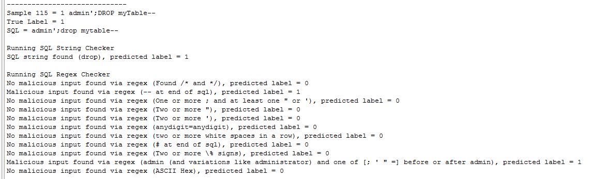
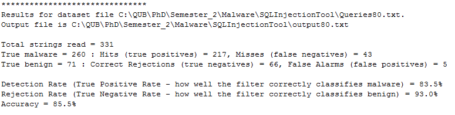
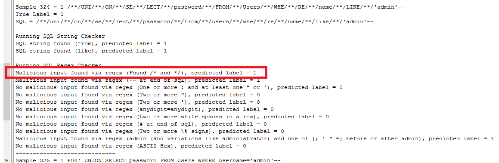

# sql-injection-filter

Please feel free to email me anytime about this via smillar09@qub.ac.uk, or tweet me @StuartMillar.

Intro
-----
This is a simple SQL injection filter that attempts to detect malicious SQL strings from a pre-defined dataset of malicious (including obfuscated) and benign samples.  Note this tool does not carry out sanitisation of input, where input is transformed into something that conforms to a specification.  Blacklisting was used, since there was no context when creating the dataset, which is needed when creating a whitelist, e.g. a whitelist could be a list of ten users who have access to a certain database.

The Tool
--------
The tool, developed in Java, reads in each sample from the dataset and classifies it as malicious or benign.  It also creates a set of results for the dataset - the number of hits (true positives), the number of misses (false negatives), correct rejections (true negatives) and false alarms (false positives).  These are used in calculating the malicious SQL detection rate (the true positive rate - how well the tool correctly classifies malicious SQL), the rejection rate (the true negative rate - how well the tool correctly classified benign SQL) and the overall accuracy.

The methods used are string searches and regexes.  The tool outputs a list of the malicious strings that were found in the SQL sample.  All the regexes used were written by me using the Oracle Java Documentation.  The resulting output from checking the SQL samples using the regexes includes both regexes that returned a match, and those that didn't, so we can inspect them to see which were triggered and also lets us tune them during development in case of errors.  The functionality is found in the two methods sqlStringChecker() and sqlRegexChecker().  The tool converts all samples to lower case, removing any obfuscation attempts by mixing upper and lower case letters.

The Dataset
-----------
This labelled dataset can be found in /dataset.  But you can easily use your own too.  10% of the malicious samples and 10% of the benign samples were randomly removed and not used for tuning the tool during development.  The patterns themselves were selected from studying the remaining malicious samples in the dataset.  I'd recommend you do this too (i.e. split out your test dataset and don't even look at the patterns in it), to avoid data-snooping, so that you have two datasets.  Or, create another independent dataset at the start to keep to one side, not to be studied or analysed, and used for testing after you perhaps tune or enchance my filter tool, if that's what you're gonna do!

Data-snooping
-------------
I get avoid data-snooping may be easier said than done! :) But if you are new to this, hear me out - we don't want to tune the tool too closely to the whole dataset, or it might not generalise well to other SQL samples.  The principle is that if a dataset has been affected or influenced any step in the development process, the tool's ability to assess the outcome has been compromised.  Looking at the dataset too closely and too early in the process is known as data-snooping.  When we datasnoop, we think we end up with better performance.  When we look at the dataset we are vulnerable to designing the tool depending on the idiosyncrasies of that dataset. So a filter tool performs well on that dataset but it is not known how it performs on an independently generated dataset.  If accuracy is too high then the tool may be overfitted.  This is way you should take your test set and set it to one side, don't look at it, as if it was a real-world scenario with a bunch of SQL your tool had never, ever seen before. And you shouldn't see it either!  Since in your head, you might recall a particular pattern that was in your test set that you can't see in the training set.  So you make a regex for that pattern, when you shouldn't i.e. you've datasnooped.

Examples
--------
For a SQL sample as follows –

admin'--

This is flagged as malicious since two regex patterns match it.  One matches “--“ at the end of the sample, which when included in a SQL query comments out anything afterward on certain implementations, and the other matches “admin’”.  The console output is detailed and lists each sample along with any malicious input found by string checking or using the regexes.  As per the aforementioned, it also has the results at the end, the number of hits (true positives), number of misses (false negatives), correct rejections (true negatives) and false alarms (false positives).  These are used in calculating the malicious SQL detection rate (the true positive rate – how well the tool correctly classifies malicious SQL), the rejection rate (the true negative rate – how well the tool correctly classified benign SQL) and the overall accuracy.  There is basic summary output file written too with each SQL sample, its true label, and the predicted label.

*Example console output - sample analysis*

*Example console output - results*

*Example console output - showing detection of obfuscated SQL*

Blacklisting v Whitelisting
---------------------------
With blacklisting, for total effectiveness in theory, every single potential malicious SQL string, command or syntax would need to be on the blacklist.  This is incredibly difficult in practice so it is expected that there would always be false negatives with this method, with some malicious input getting through.    In comparison, if a whitelisting approach was used, where only valid inputs that were on the list are deemed safe and acceptable, then it is likely false positives would be much higher, as we would have more false alarms from inputs that could very close to a whitelist item, but not an exact match, so would be flagged as malicious even if it was obvious they were not.

Future Work / Disclaimer
------------------------
It needs to be pointed out the tool it is not foolproof as it stands.  If it was tested in the wild, as it were, the blacklist of commands, syntax and regexes would need to be significantly larger.  This is the main issue with blacklisting – one needs to be sure that every permutation of malicious input is on the list, and this is not a trivial task by any means.  If an attacker was able to use an obfuscation technique that was not covered by the regexes, then obviously the filter is rendered useless.  It is thought though that obfuscated malicious input is likely to still be flagged by at least one regex for some sort of suspicious syntax, as they are quite precise.  Another drawback is the SQL string checker contains strings that may be used in everyday language, depending on the context, for example submitted in a couple of sentences via a form.  So there is a chance that false positives would be higher than acceptable levels.  

This leads us to another interesting reflection.  At present, the SQL string is classed as malicious if any of the regexes, or the SQL string checker, deem it as such.  This may not translate to the real world as many false alarms could occur, as I have said above.  A grading system may be more appropriate, using weak indicators and strong indicators of malware, akin to weighting.  For example, consider if (after running all the regexes and the SQL string checker) the only indicator of malicious input was two or more white spaces in the sample.  In truth, that is not conclusive evidence that the input is malicious.  In fact we could argue the opposite – it is almost certainly benign.  Thus for future work we would research adding weights to the regexes and the SQL string checker, and setting some sort of overall score threshold for classification.  

The context is important – for example a large text area is not an ideal place to use a regex matching one or more white spaces in order to classify input as malicious.  Username or password fields do not commonly have white spaces so it may more useful here.  Having different filters for multiple fields on a page may be the solution.

It is important to discussion parameterisation of SQL queries.  OWASP state SQLi is best prevented in this way [1].  The implementation varies by language but in general SQL statements are prepared first that contain variables, then the values of those variables are used in the query, and it is executed.  The SQL is not dynamically built as the user input is not being directly added to the query, thus avoiding SQLi.  With parameterisation, the SQL logic is created and prepared first, and then the user input is added.  Thus, using type safety and other validation methods means that the parameterisation prevents injection.  There may be a cost for this though in the form of performance, processing and memory overhead on the server handling all the prepared statements, since they need to be readied before adding the parameters to them.  The secure coding skills needed to implement them correctly needs to be present in a development team too.  Further research would be needed to conclusively compare performance of parameterised versus dynamic SQL queries.

Finally, some improvements could be made to the tool in the next version, with more of the console output information being written to the output text file instead of the current basic output.  The code could benefit from better object oriented design, less use of the static keyword and perhaps a GUI could be created to let the user select the dataset files and edit filter rules, which are all hard-coded at present.  Over to you!

References
----------
\[1] OWASP, SQL Injection https://www.owasp.org/index.php/SQL_Injection
